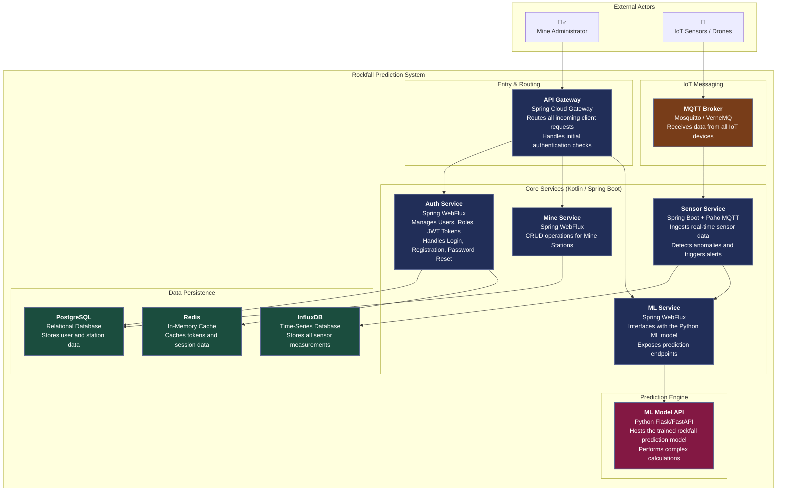

```mermaid
graph TD
    %% Define Actors
    subgraph "External Actors"
        direction LR
        actor_admin[👷‍♂️<br>Mine Administrator]
        actor_sensor[📡<br>IoT Sensors / Drones]
    end

    %% Define System Boundary
    subgraph "Rockfall Prediction System"
        direction LR

        %% API Gateway as the entry point
        subgraph "Entry & Routing"
            container_gateway[<b>API Gateway</b><br>Spring Cloud Gateway<br>Routes all incoming client requests<br>Handles initial authentication checks]
        end

        %% Core Services
        subgraph "Core Services (Kotlin / Spring Boot)"
            direction TB
            container_auth[<b>Auth Service</b><br>Spring WebFlux<br>Manages Users, Roles, JWT Tokens<br>Handles Login, Registration, Password Reset]
            container_mine[<b>Mine Service</b><br>Spring WebFlux<br>CRUD operations for Mine Stations]
            container_sensor[<b>Sensor Service</b><br>Spring Boot + Paho MQTT<br>Ingests real-time sensor data<br>Detects anomalies and triggers alerts]
            container_ml[<b>ML Service</b><br>Spring WebFlux<br>Interfaces with the Python ML model<br>Exposes prediction endpoints]
        end

        %% AI/ML Component
        subgraph "Prediction Engine"
            container_python_ml[<b>ML Model API</b><br>Python Flask/FastAPI<br>Hosts the trained rockfall prediction model<br>Performs complex calculations]
        end

        %% Data Stores
        subgraph "Data Persistence"
            direction TB
            db_postgres[<b>PostgreSQL</b><br>Relational Database<br>Stores user and station data]
            db_influx[<b>InfluxDB</b><br>Time-Series Database<br>Stores all sensor measurements]
            db_redis[<b>Redis</b><br>In-Memory Cache<br>Caches tokens and session data]
        end

        %% Messaging System
        subgraph "IoT Messaging"
            broker_mqtt[<b>MQTT Broker</b><br>Mosquitto / VerneMQ<br>Receives data from all IoT devices]
        end
    end

    %% Define Connections
    actor_admin --> container_gateway
    actor_sensor --> broker_mqtt
    
    container_gateway --> container_auth
    container_gateway --> container_mine
    container_gateway --> container_ml

    container_auth --> db_postgres
    container_auth --> db_redis
    container_mine --> db_postgres
    broker_mqtt --> container_sensor
    container_sensor --> db_influx
    container_sensor --> container_ml
    container_ml --> container_python_ml

    %% Style Definitions
    classDef service fill:#212E58,stroke:#5C6892,stroke-width:2px,color:#fff;
    classDef database fill:#1B4D3E,stroke:#5C6892,stroke-width:2px,color:#fff;
    classDef gateway fill:#4A0404,stroke:#5C6892,stroke-width:2px,color:#fff;
    classDef messaging fill:#783d19,stroke:#5C6892,stroke-width:2px,color:#fff;
    classDef ml fill:#831843,stroke:#5C6892,stroke-width:2px,color:#fff;

    class container_gateway,container_auth,container_mine,container_sensor,container_ml service
    class db_postgres,db_influx,db_redis database
    class broker_mqtt messaging
    class container_python_ml ml
```
